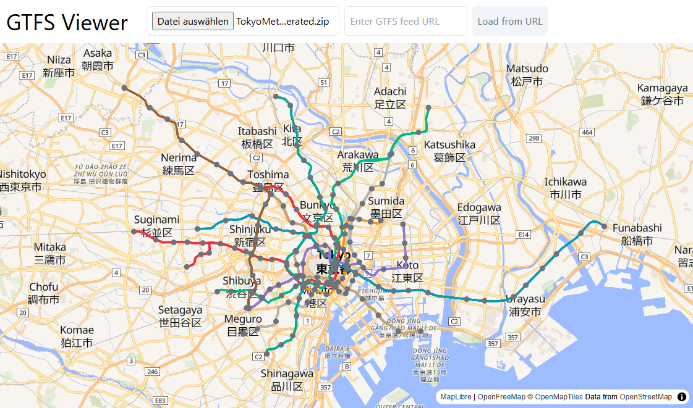

# GTFS Viewer
GTFS Viewer is a React based webapp that allows you to visualize and inspect a zip file from a gtfs feed.



### Run Local
1. clone the repository
2. cd into the folder
3. run ```npm run start```

### Features
- 100% local file processing
- load feed by using a feed url (pay attention to corse errors)
- load feed by using a local file
- visualize all stops
- visualize all trips
- hover over elements to view more details